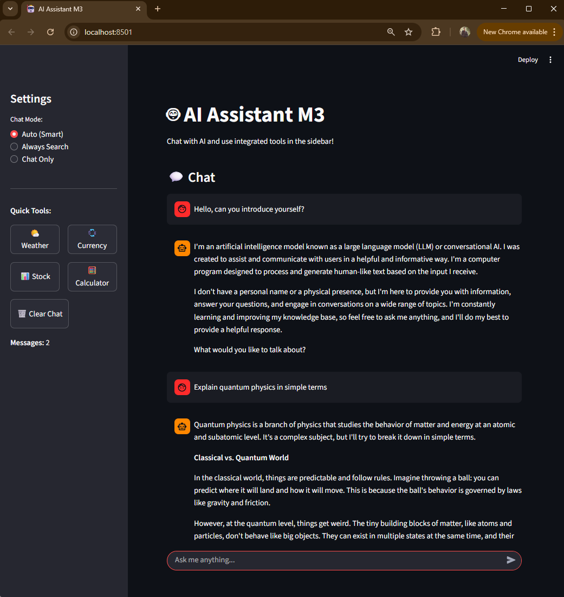
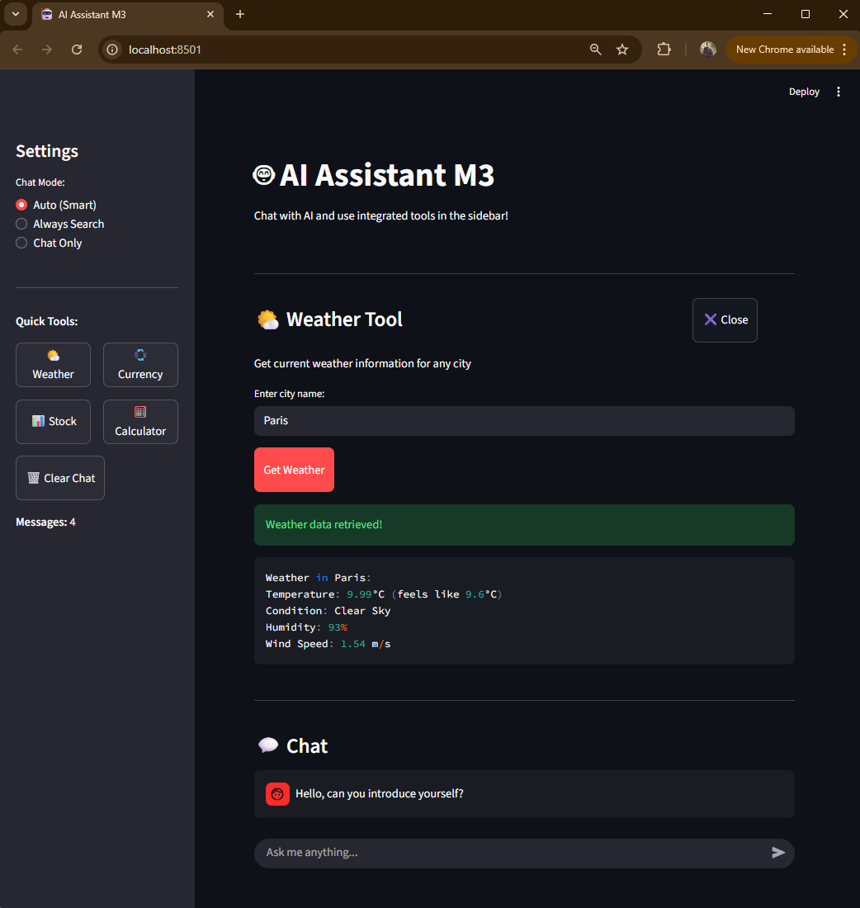
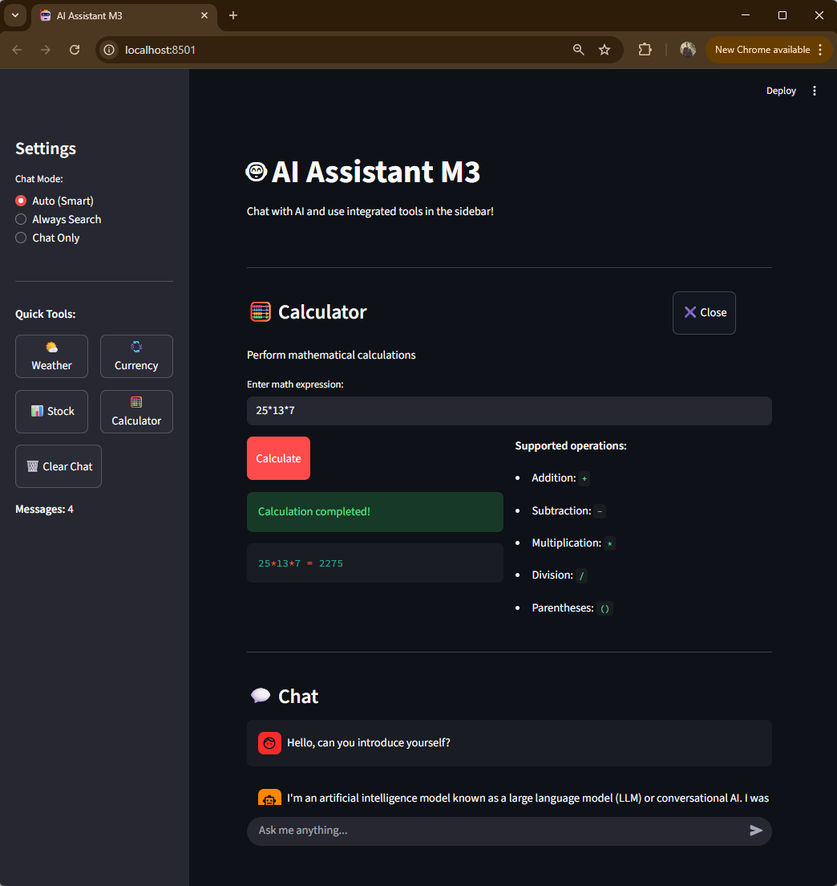

# AI Assistant M3 🤖

A powerful, multi-functional AI assistant built with Streamlit that combines conversational AI with integrated tools for weather, currency conversion, stock prices, and calculations.

## Features

### 🧠 Intelligent Chat Modes

- **Auto (Smart)**: Automatically decides when to search the web based on your question
- **Always Search**: Every question triggers a web search for the most current information
- **Chat Only**: Pure conversational AI without web searches

### 🛠️ Integrated Tools

- **🌤️ Weather Tool**: Get real-time weather data for any city worldwide
- **💱 Currency Converter**: Convert between major currencies with live exchange rates
- **📊 Stock Price Lookup**: Get current stock prices and market information
- **🧮 Calculator**: Perform mathematical calculations safely

### 💬 Advanced Chat Features

- Persistent conversation history
- Chat statistics and analytics
- Message export capabilities
- Clean, intuitive interface

## 📷 Sample Screenshots

**Chat Mode**

<div align="center">

</div>

**Weather Tool**

<div align="center">

</div>

**Currency Converter Tool**

<div align="center">

</div>

**Calculator Tool**

<div align="center">

</div>

## Prerequisites

- Python 3.8 or higher
- Required API keys (see Configuration section)

## Installation

1. **Clone or download this project**

   ```bash
   git clone <your-repo-url>
   cd ai-assistant-m3
   ```

2. **Install required packages**

   ```bash
   pip install streamlit python-dotenv langchain langchain-community requests
   ```

3. **Set up environment variables**
   - Copy the `.env.example` file to `.env`
   - Fill in your API keys (see Configuration section)

## Configuration

Create a `.env` file in your project directory with the following API keys:

```env
# Required API Keys
GROQ_API_KEY=your_groq_api_key_here
SERPAPI_API_KEY=your_serpapi_key_here

# Optional API Keys (for enhanced features)
OPENWEATHER_API_KEY=your_openweather_key_here
```

### Getting API Keys

#### 1. Groq API Key (Required)

- Visit [console.groq.com](https://console.groq.com)
- Sign up for a free account
- Navigate to API Keys section
- Generate a new API key
- Copy the key to your `.env` file

#### 2. SerpAPI Key (Required)

- Visit [serpapi.com](https://serpapi.com)
- Sign up for a free account (100 searches/month free)
- Go to your dashboard
- Copy your API key to the `.env` file

#### 3. OpenWeatherMap API Key (Optional)

- Visit [openweathermap.org](https://openweathermap.org/api)
- Sign up for a free account
- Generate an API key
- Add to `.env` file for enhanced weather features

## Usage

### Starting the Application

```bash
streamlit run 8_AI-Assistannce_WebUI-v3.py
```

The application will open in your default web browser at `http://localhost:8501`.

### Using the Chat Interface

1. **Choose your chat mode** in the sidebar:

   - **Auto**: Best for general use
   - **Always Search**: When you need the latest information
   - **Chat Only**: For conversations without web searches

2. **Type your message** in the chat input at the bottom

3. **Use quick tools** from the sidebar for specific tasks

### Tool Usage Examples

#### Weather Tool

- Click "🌤️ Weather" in the sidebar
- Enter any city name (e.g., "London", "Tokyo", "New York")
- Get current temperature, conditions, humidity, and wind speed

#### Currency Converter

- Click "💱 Currency" in the sidebar
- Enter amount and select currencies
- Get real-time exchange rates

#### Stock Price Lookup

- Click "📊 Stock" in the sidebar
- Enter stock ticker (e.g., "AAPL", "GOOGL", "TSLA")
- Get current market information

#### Calculator

- Click "🧮 Calculator" in the sidebar
- Enter mathematical expressions
- Supports: `+`, `-`, `*`, `/`, `()`

### Chat Examples

```
User: What's the weather in Paris today?
AI: [Gets current weather data for Paris]

User: Convert 100 USD to EUR
AI: [Provides current exchange rate and conversion]

User: What's Apple's stock price?
AI: [Searches for current AAPL stock information]

User: Calculate 25 * 8 + 10
AI: 25 * 8 + 10 = 210
```

## File Structure

```
ai-assistant-m3/
├── 8_AI-Assistannce_WebUI-v3.py  # Main application file
├── .env.example                   # Environment variables template
├── .env                          # Your API keys (create this)
├── README.md                     # This file
└── requirements.txt              # Python dependencies
```

## Dependencies

Create a `requirements.txt` file with:

```txt
streamlit>=1.28.0
python-dotenv>=1.0.0
langchain>=0.1.0
langchain-community>=0.0.10
requests>=2.31.0
```

Install with: `pip install -r requirements.txt`

## Troubleshooting

### Common Issues

1. **"API key not configured" error**

   - Ensure your `.env` file exists and contains the correct API keys
   - Check that there are no extra spaces in your API keys

2. **"Module not found" error**

   - Install missing packages: `pip install <package-name>`
   - Try upgrading packages: `pip install --upgrade <package-name>`

3. **Weather tool shows API error**

   - The weather tool will fallback to web search if OpenWeatherMap API key is not configured
   - For best results, add the `OPENWEATHER_API_KEY` to your `.env` file

4. **Search not working**
   - Verify your SerpAPI key is valid and has remaining credits
   - Check SerpAPI dashboard for usage limits

### Error Messages

- **"GROQ_API_KEY not found"**: Add your Groq API key to the `.env` file
- **"SERPAPI_API_KEY not found"**: Add your SerpAPI key to the `.env` file
- **"Rate limit exceeded"**: Wait or upgrade your API plan

## Customization

### Adding New Tools

To add new tools to the sidebar:

1. Create a button in the sidebar section
2. Add a session state variable for the tool
3. Create the tool interface using containers and columns
4. Implement the tool functionality

### Modifying Chat Behavior

Edit the chat response logic in the main chat interface section to customize how the AI responds to different types of questions.

### Styling

Modify the CSS in the `st.markdown()` sections to change the appearance of buttons and other elements.

## Security Notes

- Keep your API keys secure and never commit them to version control
- Use environment variables for all sensitive configuration
- The calculator tool uses `eval()` with input sanitization - only basic math operations are allowed

## Contributing

1. Fork the repository
2. Create a feature branch
3. Make your changes
4. Test thoroughly
5. Submit a pull request

## License

This project is open source. Feel free to modify and distribute as needed.

## Support

If you encounter issues:

1. Check the troubleshooting section above
2. Verify all API keys are correctly configured
3. Ensure all dependencies are installed
4. Check the Streamlit documentation for interface issues

## Version History

- **v3.0**: Current version with integrated tools and enhanced UI
- **v2.0**: Added Flask web interface
- **v1.0**: Basic command-line interface

---

**Enjoy using your AI Assistant M3! 🚀**
